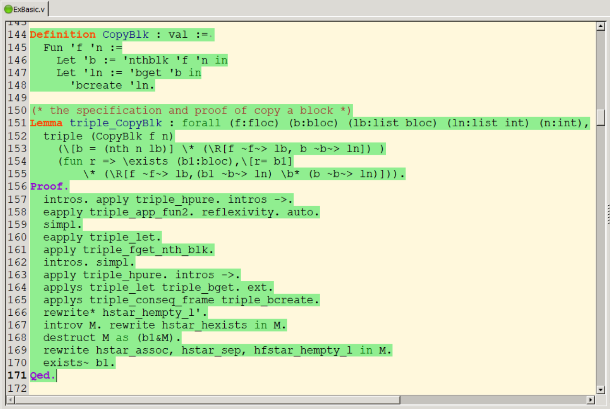

# Formal Verification of Cloud Block Storage in Coq

To rigorously discuss the reliability of cloud block storage (CBS), we develop a proof system and implement a verification tool for reasoning about the correctness of CBS data operations. The proof system has separation logic features, and the tool simplifies derivation while retaining mathematical rigor.

This proof system consists of the modeling language, heap predicates, triples, and reasoning rules. The modeling language represents CBS state and data operations, and the heap predicates describe the properties of a given CBS state. Besides, the triples specify the correct behavior of a program, and the reasoning rules supports verifying those triples.

We implement this proof system as a verification tool in Coq. Our tool can encode actual operations intuitively and verify specifications efficiently. The notations and type conversions in our tool improve the readability of the representation code. The automated proof scripts simplify the verifying process and skip the unnecessary details. 

## How We Reason about CBS Programs

First, code a function with the modeling language to represent an actual CBS data operation.

```Coq
Definition CopyBlk : val := 
  Fun 'f 'n := 
  	Let 'b := 'nthblk 'f 'n in     (* get the target block's loction *)
    Let 'ln := 'bget 'b in         (* get the block's contents *)
      'bcreate 'ln                 (* create a new block *)
```

Second, specify the invocation of this function by a triple. This triple captures the system properties before and after the function invocation.

```Coq
Lemma triple_CopyBlk : forall (f:floc) (b:bloc) (lb:list bloc) (ln:list int) (n:int),
  triple (CopyBlk f n)  (* invocate the function *)
(* pre-condition: the pure fact constrains the location; the predicate describes the storage of the target block *)
    ( \[b = nth n lb] \* \R[f ~f~> lb, b ~b~> ln] )
(* post-condition: the pure fact describes the new block's location; the predicate additionally declares that a new block has been created *) 
    ( fun r => \exists (b1:bloc), \[r=b1] \* (\R[f ~f~> lb,(b1 ~b~> ln) \b* (b ~b~> ln)]) ).
```

Last, reason and prove such a triple using the proven reasoning rules. If this triple can be proved, it is sound since the reasoning rules are all sound. 

```Coq
Proof.
  intros. apply triple_hpure. intros ->.
  applys* triple_app_fun2. ext.                (* invoke a funcation *)
  applys* triple_let triple_fget_nth_blk. ext. (* get the block's loc *)
  applys triple_let triple_bget. ext.          (* get the block's contents *)
  applys triple_conseq_frame triple_bcreate.   (* create a new block *)
  rewrite* hstar_hempty_l'.                  (* rewrite the format and complete proof *)
  introv M. rewrite hstar_hexists in M.
  destruct M as (b1&M).
  rewrite hstar_assoc, hstar_sep, hfstar_hempty_l in M.
  exists~ b1.
Qed.
```

## Overview of Implementation

The Implementation of our proof system mainly consists the following parts:.

- Modeling Language  ——  Language.v
- Assertion Language  ——  CBS heap predicates (Himpl.v) + Internal heap predicates (InnerPre.v)
- Hoare Logic  —— Hoare.v
- The proof system for CBS —— TripleAndRules.v
- Verification of basic operations  ——  ExBasic.v
- Verification of data modifications ——  ExModification.v
- Verification of a MapReduce application (WordCount) ——  ExMapReduce.v
- Variable Notations —— Var.v 

In additions, our tool depends on a Coq standard library (TLC.v) and a definition of finite map (Fmap.v).

The implementation of the verification tool amount to 5664 non-blank lines of Coq script. It includes 115 definitions, 368 lemmas, and the verifications of 12 scenarios.

## Environment

- Coq Version : Coq 8.8.0

- IDE : VScode

- OS : Windows 10

## Installation

The standard installation procedure requires Coq 8.8.0. If you do not have it yet, please [install Coq](https://github.com/coq/coq/releases/download/V8.8.0/coq-8.8.0-installer-windows-x86_64.exe) first.

To install the latest development version of our tool, use this:

```
  git clone https://github.com/BinksZhang/CBS-Verification.git
  cd CBS-Verification
  make
```

**Note** : <font color=red>Only English or Number is allowed in the file path!!</font>

## Replaying a Sample Proof

Then, you can load an example proof. There are several examples in the files ExBasic.v, ExModification.v, and ExMapReduce.v. Just use the CoqIDE to open a file and check the corresponding proof. The success proof of a program will be as follows.



